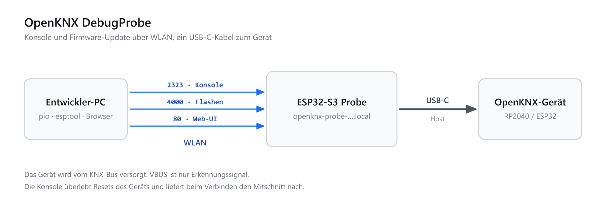

# OpenKNX DebugProbe

Mobiler WLAN-Debugger auf ESP32-S3, der ein OpenKNX-Gerät (RP2040 oder ESP32) über ein
einziges USB-C-Kabel fernwartet: **Firmware-Update** und **serielle Konsole über TCP**.



## Warum

OpenKNX-REG1-Geräte sitzen im Schaltschrank. Firmware-Update und Debug-Konsole erfordern
bisher einen Laptop vor Ort. Die Probe hängt am Gerät und wird über WLAN angesprochen.

Die Probe ist gezielt für OpenKNX-Geräte entwickelt, gehört aber nicht zum OpenKNX-Projekt:
ein privates Werkzeug, vorerst ohne Verbindung zur OpenKNX-Gruppe.

## Stand

**Funktionsfähig und am Gerät verifiziert.** Der komplette Entwicklungszyklus läuft über
WLAN:

| | |
|---|---|
| WLAN-Einrichtung | Captive Portal, 3 Verbindungsversuche, dann Notfall-AP |
| Selbst-Update | HTTP-OTA mit A/B-Slots und automatischem Rollback |
| Zielgerät erkennen | RP2040, ESP32, STM32, CH34x/CP210x/FTDI — mit Seriennummer |
| Konsole | `socket://…:2323` mit 16-KB-Mitschnitt, überlebt Resets des Ziels |
| Steuerleitungen | `rfc2217://…:4000` mit Baudrate und DTR/RTS |
| Firmware aufs Ziel | UF2 per HTTP, vollständig validiert, dann über USB-MSC geschrieben |
| Weg nach BOOTSEL | 1200-Baud-Touch, von der Probe selbst abgesetzt — kein Tastendruck |
| Kommandos ans Ziel | Eingabezeile im Browser, Zeilenende wählbar, Verlauf mit ↑/↓ |
| Stromsparen | Funk dost, solange kein Client auf 2323 oder 4000 hängt |
| Konsole im Browser | mitlesen ohne Terminal, Prompt und ANSI werden aufgelöst |
| Konfiguration abholen | die fertigen `platformio.ini`-Zeilen als Kopierfeld und über `/api/snippet` |

Architektur, Hardware und Schnittstellen im Detail: **[docs/](docs/)**.

## Betriebsarten

- **Normalbetrieb:** `usb_host_cdc_acm` liest die Konsole des Ziels, ein TCP-Server auf
  Port 2323 reicht sie an den PC weiter.
- **Flashen:** 1200-Baud-Touch → Ziel rebootet nach BOOTSEL → `usb_host_msc` schreibt die
  UF2 in rohen 512-Byte-Sektoren → Reset. Den Touch setzt `POST /api/flash` selbst ab,
  **nachdem** die UF2 vollständig geprüft ist; am Gerät muss dafür niemand Taster drücken.
  Bleibt der Massenspeicher aus, wird ein Versuch wiederholt, danach kommt ein `409` mit
  Begründung — und die Konsole steht wieder auf 115200 mit Ruhepegel auf DTR/RTS.

Der Funk spart Strom, wenn niemand zuhört: solange ein Client auf 2323 oder 4000 hängt,
läuft er mit `WIFI_PS_NONE`, sonst dost er im `MIN_MODEM`. Der Konsolen-Livestream und das
Flashen sind davon nachweislich nicht betroffen — der ESP32-S3 wird im Leerlauf aber
deutlich kühler. Abstimmen darf nur ein akzeptierter TCP-Client: HTTP, das Web-UI und
API-Aufrufe halten den Funk **nicht** wach. Ein offener Browser-Tab kostet also nichts,
ein liegengelassenes `pio device monitor` schon. Der aktuelle Zustand steht als
`radio_awake` in `/api/status` und als Zeile „Funk" im Web-UI.

Das Web-UI der Probe liest die Konsole nicht nur mit, sondern hat auch eine Zeile zum
**Senden von Kommandos** ans Zielgerät. Das Zeilenende ist wählbar (CR, LF, CRLF, ohne),
weil die OpenKNX-Konsole zeichenweise arbeitet und andere Firmware auf eine ganze Zeile
wartet. ↑/↓ blättert durch die zuletzt gesendeten Kommandos.

Am PC ist keine zusätzliche Hardware nötig — ein paar Zeilen in der `platformio.ini` des
Zielprojekts genügen. Die passenden liefert die Probe selbst, denn sie kennt ihren eigenen
Namen und weiß, was angesteckt ist:

```powershell
curl.exe http://openknx-probe-xxxx.local/api/snippet
```

Im Web-UI stehen dieselben Zeilen in zwei Kopierfeldern, sobald ein Ziel erkannt ist. Wer
sie lieber selbst schreibt:

```ini
; RP2040-Ziel (UF2 über HTTP)
monitor_port    = socket://openknx-probe-xxxx.local:2323
upload_protocol = custom
upload_command  = curl --fail-with-body --data-binary "@$BUILD_DIR/${PROGNAME}.uf2" http://openknx-probe-xxxx.local/api/flash

; ESP32-Ziel (esptool über RFC2217)
upload_port     = rfc2217://openknx-probe-xxxx.local:4000
upload_speed    = 460800
```

Vollständig kommentiert in [tools/platformio-snippet.ini](tools/platformio-snippet.ini).

## Bauen und flashen

```powershell
cd firmware
pio run              # bauen
pio run -t upload    # flashen (Port wird selbst gesucht)
```

PlatformIO mit `framework = espidf`, Plattform espressif32 54.3.21 (ESP-IDF 5.4.2).
Ein separates ESP-IDF-Setup ist nicht nötig.

## Erstinbetriebnahme

1. Flashen. Die Probe findet keine Zugangsdaten und öffnet ein offenes WLAN
   `openknx-probe-<mac>`.
2. Damit verbinden — das Captive Portal öffnet sich von selbst, sonst
   `http://192.168.4.1/`.
3. Netzwerk auswählen, Passwort eingeben, optional einen eigenen Gerätenamen vergeben
   (wichtig, wenn mehrere Probes im Einsatz sind).
4. Nach dem Neustart ist die Probe unter `http://<name>.local/` erreichbar.

## Selbst-Update

Im Browser über die Startseite, oder:

```powershell
curl.exe --fail-with-body --data-binary "@firmware/.pio/build/probe/firmware.bin" `
         http://openknx-probe-xxxx.local/api/update
```

Ein fremdes oder beschädigtes Image wird mit HTTP 400 abgelehnt, bevor irgendetwas
geschrieben wird. Startet ein neues Image nicht sauber durch, fällt der Bootloader
automatisch auf das vorherige zurück.

## Sicherheit

Die Probe hat **keine Authentifizierung**. Wer sie im Netz erreicht, kann ohne weitere
Hürde

- Firmware ins angesteckte Zielgerät schreiben (`POST /api/flash`),
- die Probe selbst per OTA überschreiben (`POST /api/update`),
- Kommandos an die Konsole des Ziels schicken (`POST /api/console`),
- das Ziel nach BOOTSEL schicken (`POST /api/bootsel`) und
- die gespeicherten WLAN-Zugangsdaten löschen (`POST /api/wifi/forget`).

Auch der Einrichtungs-AP ist **offen**, ohne WPA — während der Erstinbetriebnahme kann in
Funkreichweite jeder die Zugangsdaten setzen.

Das ist Absicht: die Probe ist ein Werkzeug für den Werktisch und das eigene
Entwicklungsnetz, wo die Rundenzeit zählt und ein Login bei jedem Flash nur im Weg stünde.
Daraus folgt aber, wohin sie **nicht** gehört: nicht ins Gäste-WLAN, nicht in ein Netz mit
fremden Teilnehmern, und keinesfalls hinter eine Portfreigabe oder einen Reverse-Proxy aus
dem Internet. Bleibt sie dauerhaft im Schaltschrank, gehört sie in dasselbe
vertrauenswürdige Netz wie die Geräte, die sie flashen darf — denn genau das kann jeder,
der sie erreicht.

## Dokumentation

| Datei | Inhalt |
|---|---|
| [docs/architecture.md](docs/architecture.md) | Zustandsmaschine, Tasks, Core-Aufteilung |
| [docs/hardware.md](docs/hardware.md) | Probe-Modul, VBUS, Dongle-Konzept |
| [docs/protocol.md](docs/protocol.md) | HTTP-API und TCP-Serial-Schnittstelle |

## Lizenz

[GNU General Public License v3.0 oder später](LICENSE) (`GPL-3.0-or-later`).

Die USB-Host- und mDNS-Komponenten von Espressif, die der Build über den Component Manager
nachlädt, stehen unter Apache-2.0 und liegen nicht in diesem Repo.
