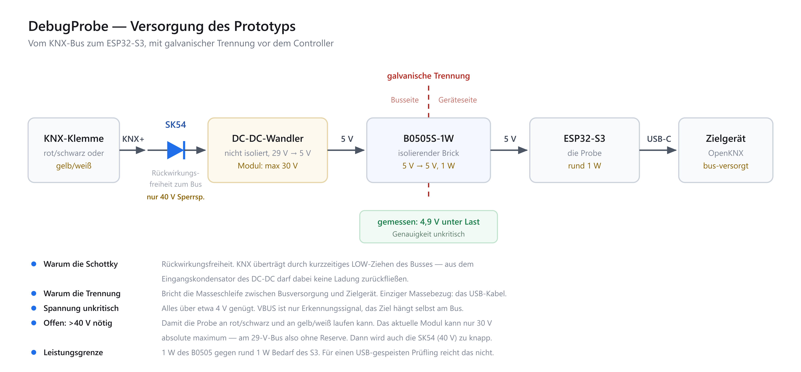

# Hardware

Stand 2026-08-19: Probe-Modul vorhanden und in Betrieb, Adapterhardware noch nicht.

## Vorhandenes Modul (am 2026-08-19 ausgelesen)

| | |
|---|---|
| Chip | ESP32-S3 (QFN56), rev v0.2, Dual Core + LP Core, 240 MHz |
| Variante | **ESP32-S3FH4R2** — 4 MB embedded Flash (XMC), 2 MB PSRAM (AP_3v3, quad) |
| Quarz | 40 MHz |
| MAC | wird beim Start ausgegeben; die letzten zwei Bytes landen im Gerätenamen `openknx-probe-<xxxx>` |
| USB | eFuse-Modus USB-Serial/JTAG, VID `303A` / PID `1001` |
| PlatformIO-Board | `esp32-s3-devkitc1-n4r2` |

Die 4 MB Flash sind der engste Punkt: zwei OTA-Slots à 1,875 MB, kein Platz für eine
UF2-Staging-Partition. Die UF2 fürs Zielgerät wird deshalb im PSRAM gepuffert.

## VBUS: nötig, aber leistungslos

**Alle OpenKNX-Geräte sind KNX-bus-gespeist** und haben ihre eigene Versorgung. Trotzdem muss die Probe VBUS liefern: die USB-2.0-Spec verlangt, dass
ein self-powered Gerät seinen D+-Pull-up erst anlegt, wenn VBUS anliegt (§7.1.5). Ohne
VBUS enumeriert das Ziel also gar nicht.

Aus VBUS gezogen wird dabei praktisch nichts — das Gerät überwacht die Leitung nur. Damit
gilt:

- Der isolierte Wandler muss nur den ESP32-S3 tragen (~1–1,5 W), nicht das Zielgerät.
- Der Busstrom bleibt bei ~30 mA; das 150-mA-Szenario entfällt.
- Rückspeisung ist die verbleibende Gefahr: die OpenKNX-Geräte haben im 5-V-Pfad eine
  Rücklaufsperre, die Schottky in der Zuleitung ist Redundanz.

Am Prüfstand gilt das **nicht**: ein blankes RP2040-Devkit ist USB-gespeist und zieht
echten Strom aus VBUS. Für Bankarbeit muss der Pfad also doch belastbar sein.

### Folge: kein Reset über VBUS

Bei einem busgespeisten Ziel bewirkt VBUS aus/ein nur ein simuliertes Abziehen des Kabels
— der RP2040 läuft weiter. Der Reset über die Versorgung fällt als Werkzeug also aus:

| Weg | funktioniert, wenn |
|---|---|
| 1200-Baud-Touch auf der CDC | die Ziel-Firmware noch enumeriert — **setzt die Probe selbst ab** |
| VBUS aus/ein | nur Re-Enumeration erzwingen, **kein** Reset |
| BOOTSEL + RUN an der Frontblende | immer, aber jemand muss drücken |

**BOOTSEL und RUN sind an den REG1-Geräten von der Frontblende aus bedienbar** — ohne
Kabel, ohne das Gerät zu öffnen. Damit ist der Pigtail nicht
nötig.

Im Normalfall braucht es die Taster gar nicht: `POST /api/flash` und `POST /api/bootsel`
setzen den 1200-Baud-Touch selbst ab und holen ein laufendes Ziel nach BOOTSEL. Der Ablauf
unten gilt nur für den Fall, dass die Firmware des Ziels nicht mehr enumeriert oder den
Touch nicht auswertet:

1. Jemand vor Ort drückt BOOTSEL + RUN.
2. Das Gerät meldet sich als `RPI-RP2`; die Probe erkennt das selbsttätig und zeigt im
   Web-UI „BOOTSEL, flashbereit".
3. Die UF2 wird aus der Ferne eingespielt.

Ein Tastendruck von jemandem, der ohnehin im Haus ist, ersetzt damit den Servicetermin mit
Laptop.

## Warum ein reines USB-C-C-Kabel nicht reicht

Ein USB-C-Port schaltet VBUS nur ein, wenn er über CC das Rd der Gegenseite sieht,
während er selbst Rp präsentiert. Der USB-C-Port des S3-Moduls ist als **Device**
verdrahtet (Rd) — er kann prinzipbedingt kein VBUS liefern.

Zwei Device-Ports direkt zu verbinden ist deshalb **ungefährlich, aber wirkungslos**:
beide haben Rd, keiner schaltet VBUS, beide PHYs warten auf einen Host. Gefährlich wären
nur A↔A-Kabel, bei denen zwei 5-V-Rails aufeinandertreffen.

Für den Host-Betrieb braucht es also eigene Hardware (siehe unten), nicht nur ein Kabel.

## Dongle-Konzept

Zielbild: ein geschlossener Dongle, der **nur** über KNX-Bus bzw. 29-V-Hilfsspannung
versorgt und per USB-C-Kabel ans Zielgerät gesteckt wird.



Aufgebauter Prototyp (Stand 2026-08-21):

```
KNX-Klemme --Schottky--> DCDC 29V->5V --> B0505S-1W (isoliert) --> ESP32-S3 --USB-C--> Ziel
```

Bestückt: Schottky **SK54**, DC-DC derzeit ein Fertigmodul.

**Die Schottky sitzt direkt hinter KNX+ und dient der Rückwirkungsfreiheit.** KNX überträgt,
indem der Bus kurzzeitig auf LOW gezogen wird; aus dem Eingangskondensator des DC-DC darf
dabei keine Ladung in den Bus zurückfließen. Das ist der Grund — nicht Verpolschutz.

Der isolierte Wandler bricht die Masseschleife zwischen Busversorgung und Zielgerät, sodass
der einzige Massebezug über das USB-Kabel entsteht.
