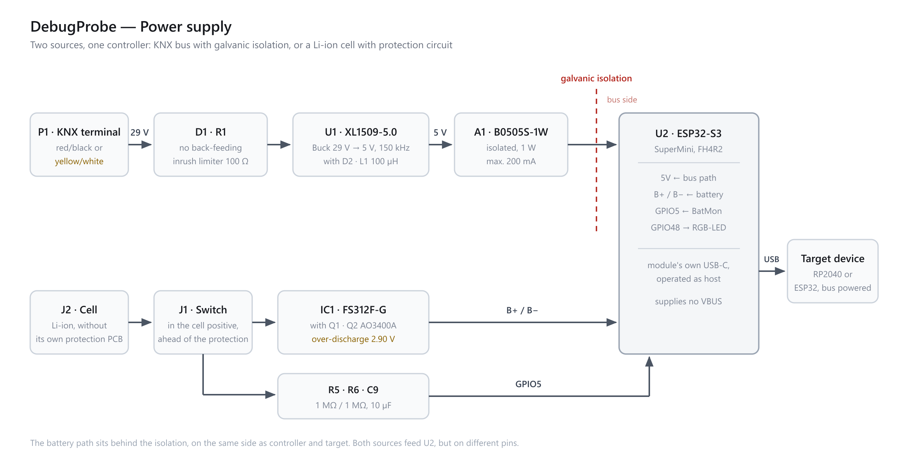
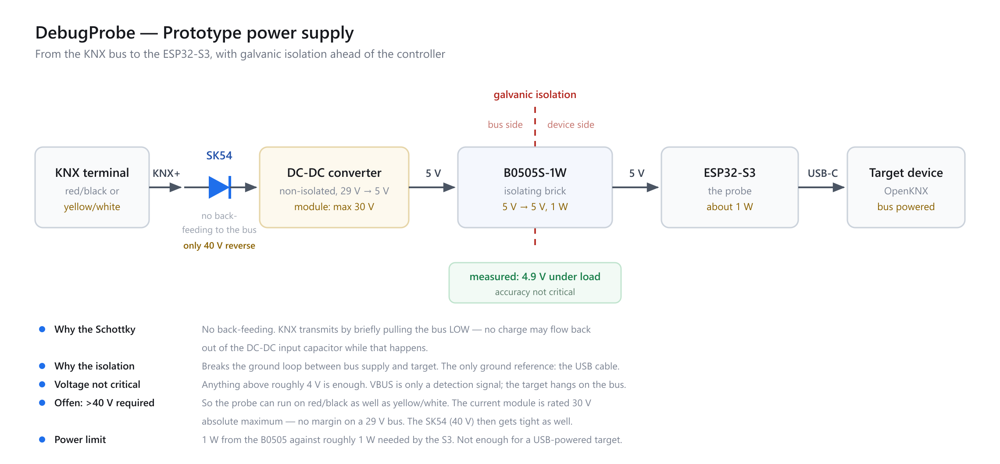

# Hardware

Schematic as PDF: [OpenKNX-DebugProbe_V0.1-Schematic.PDF](OpenKNX-DebugProbe_V0.1-Schematic.PDF)

## Probe module

The controller is an **ESP32-S3 SuperMini** (FH4R2 variant) — **not an ESP32-S3 Zero!**
The USB-C connector towards the target is the module's own — there is none on the adapter board.

The module's 4 MB of flash are the tightest constraint: two OTA slots of 1.875 MB each,
leaving no room for a UF2 staging partition. The target's UF2 is therefore buffered in
PSRAM.

## Power supply

`D1` sits directly behind KNX+ and prevents back-feeding: KNX transmits by briefly pulling
the bus LOW, and no charge may flow back into the bus from the input capacitor. That is the
reason for it — not reverse-polarity protection.

`A1` breaks the ground loop between the bus supply and the target — either the red/black or
the yellow/white terminal pair can be used, or any other supply from 5 V to 30 V.

## Battery (optional)

The battery is optional; without it the probe runs from the bus supply. Charging is handled
by the ESP32-S3 SuperMini's charger. The protection circuit against over-discharge, however,
sits on this probe board, because the cell does not bring its own.

**Open the switch when the probe is not in use.** It disconnects the cell completely, so
that neither the module nor the protection circuit draws current.

The cell voltage reaches an ADC input through a divider. Its 10 µF give a time constant of
5 s — so the first usable reading is about 30 s after switch-on.

## VBUS

All OpenKNX devices are KNX bus powered. **The probe supplies no VBUS**, and an RP2040/ESP32
target with native USB still enumerates: it asserts its D+ pull-up as soon as the board has
power.

On the bench it is different — a bare RP2040 devkit is USB powered and draws real current
from VBUS.

## Proof-of-Concept prototype

The prototype differs from the schematic: an **MP1584** module serves as the buck converter
instead of `U1`, and the battery branch is missing. The isolated converter and the
controller are the same.
